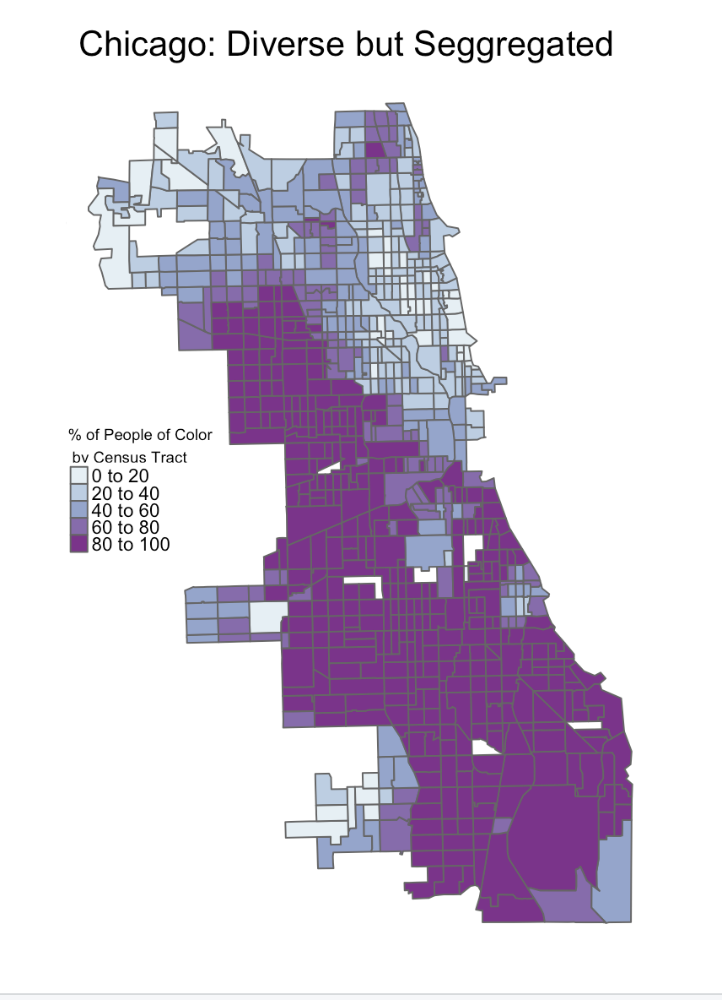
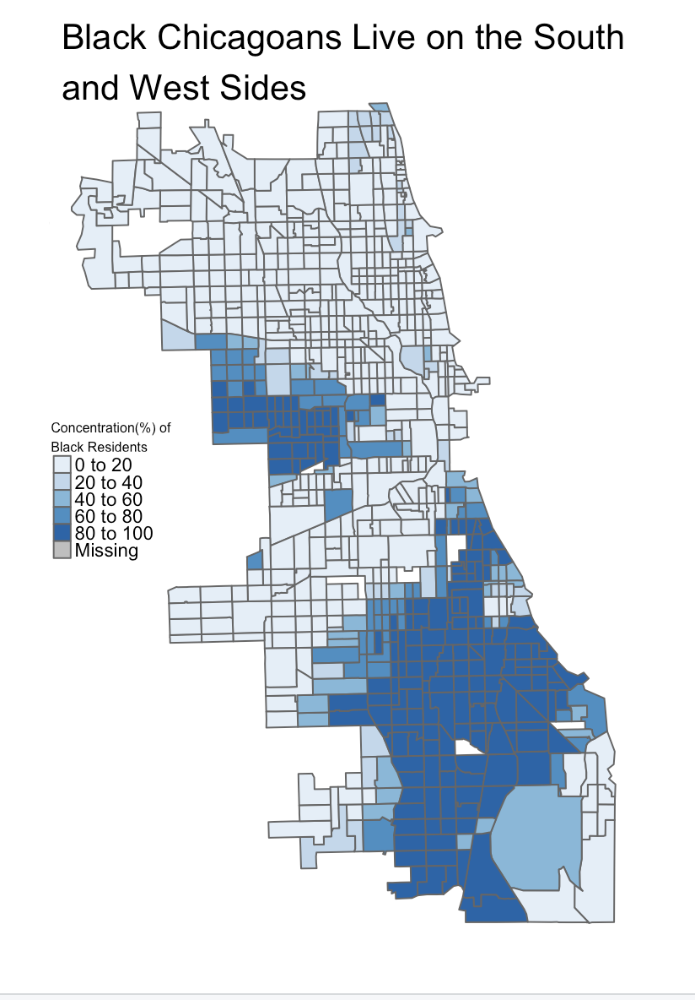
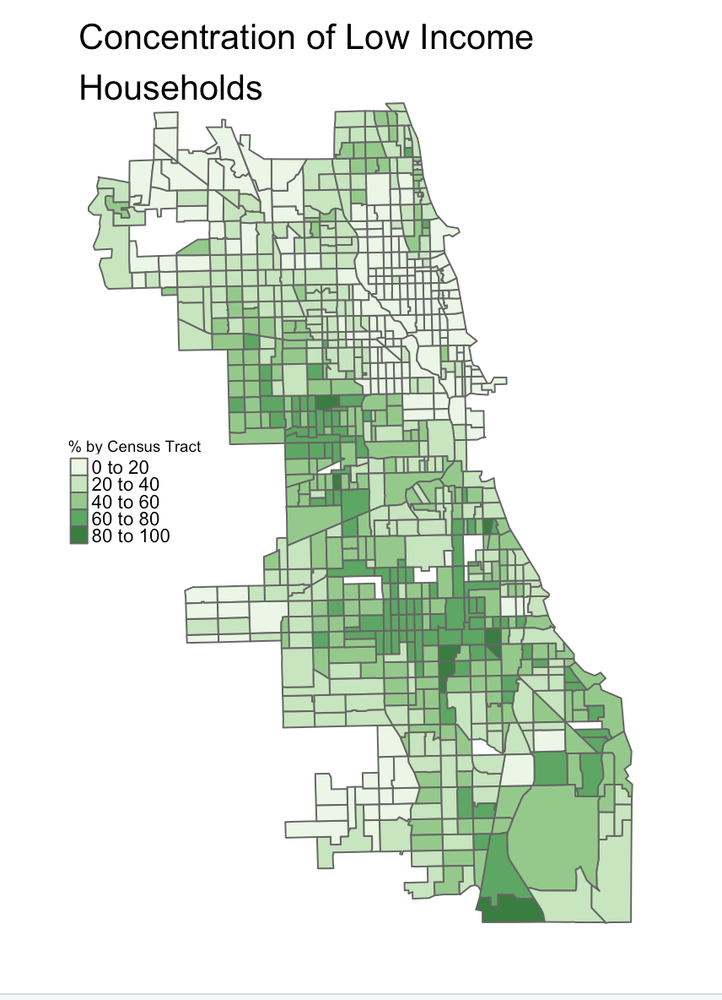

| [Home Page](https://itsmeriem.github.io/My-Data-Work/) | [Chicago's Gun Violence Epidemic](chicago-gun-violence.md) | [Federal Minimum Wage](federal-minimum-wage.md)

# Mapping Chicago's Gun Violence: A History of Segregation Created a Modern-Day Crisis

Chicago is notorious for its high crime rate. The windy city stands out among its peers. Its firearm homicide rate is [six times higher than New York City’s and three times higher than in Los Angeles](https://oneaimil.org/the-issue/impact-of-gun-violence/).

So far in 2023, 495 people have died from a gun-related homicide. **But, who is most at risk of becoming a victim of gun-related violence?**

Though, highly diverse, Chicago is one of [the most segregated cities in America](https://www.chicagomag.com/city-life/march-2017/why-is-chicago-so-segregated/).

Using data from the City of Chicago, the Census Bureau and the Environmental Protection Agency, I find that gun violence is concentrated on the West and South sides, in a few specific neighborhoods. Nearly [75% of gun violence](https://www.chicagocred.org/our-approach/) takes place in 20 of the 77 Chicago neighborhoods.

These same neighborhoods are predominantly Black. In addition to gun violence, they are hit the hardest by poverty. In a segregated city, gun violence disproportionately affects Black residents.

 

The areas hardest hit by Chicago’s gun violence epidemic face systemic issues of poverty, disinvestment, and racial segregation, dating back to the 1900s and still persistent today. 

Institutionally discriminatory housing practices, discriminatory banking and urban policies have had a lasting impact on Chicago' south side. Black people moving to Chicago during the Great Migration [faced resistance](https://storymaps.arcgis.com/stories/292ebd8ff35b4bf2937b1524f4d871af) from white communities, which led to the 1919 race riots where 38 people died. Such tensions led to convenants to keep white neighborhoods white, by restricting the selling or leasing of homes to Black people. These racially restrictive convenants were enforced in the South Side both through [public policies and private institutions, like the University of Chicago](https://storymaps.arcgis.com/stories/292ebd8ff35b4bf2937b1524f4d871af).

The infamous practice, known as "redlining," shares much of the blame for today's segregated city. Redlining was a system implemented by the Federal Housing Administration that determined the value of housing based on [the demographics of a neighborhood](https://interactive.wttw.com/firsthand/segregation/mapping-chicago-racial-segregation). The map below (sourced from [here](https://via.library.depaul.edu/mom/58/)) shows what redlining looked like in 1940 in Chicago. Most Black neighborhoods were deemed "undesirable" which restricted residents from accessing mortgages, and therefore achieving social and economic mobility.

While these practices have stopped, their effect is strong and alive. The concentration of poverty and gun violence in Black neighborhoods, shown in earlier maps, mirrors the "red lines." This deep-rooted history is a systemic problem that will require a systemic solution.

